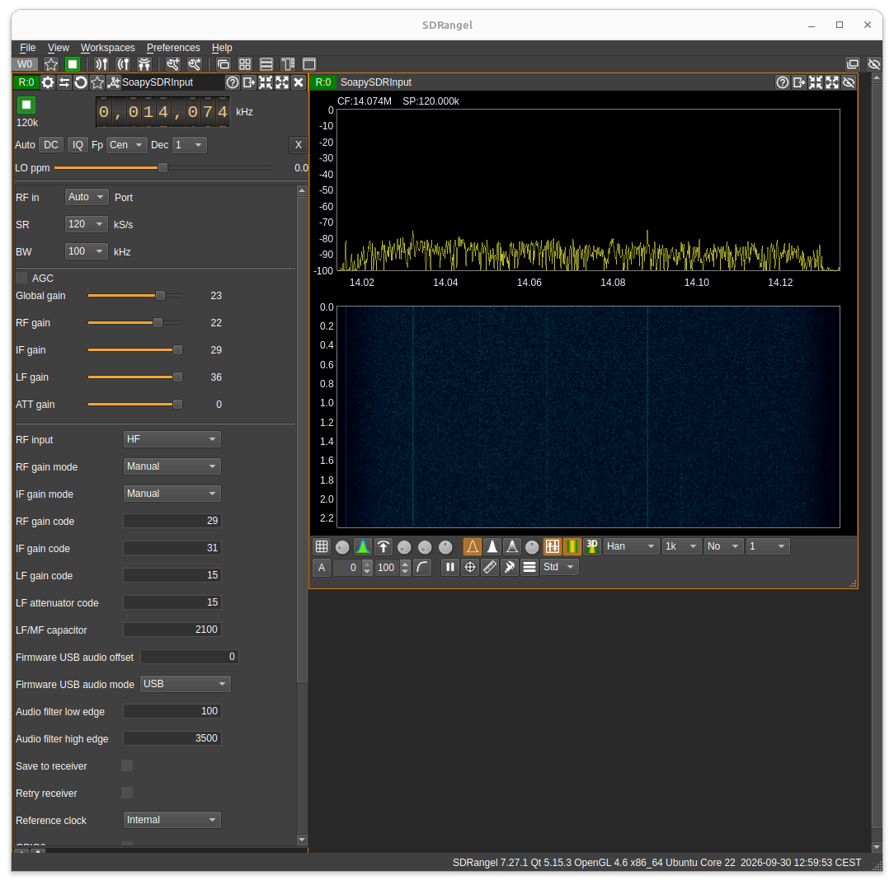
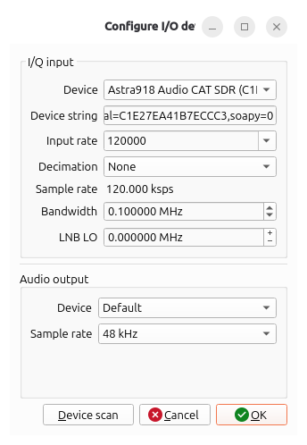
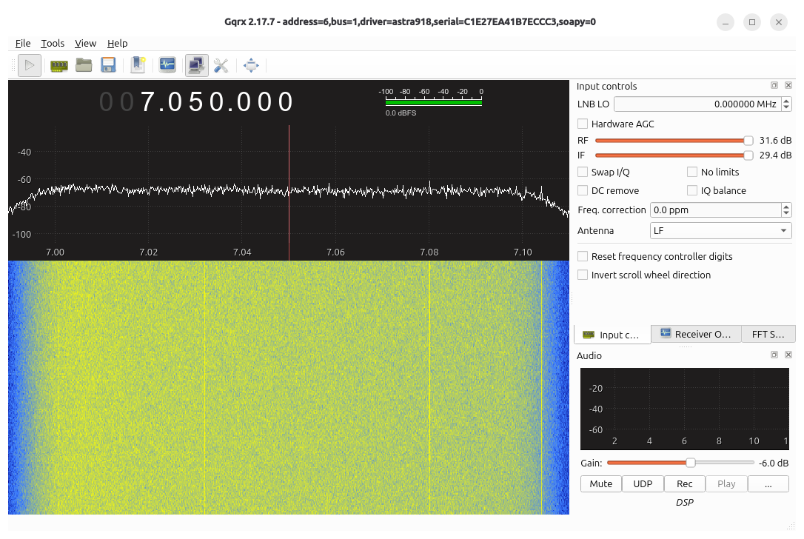

# Astra918 SoapySDR support

This repository provides a SoapySDR receive module for the Astra918. It is a
separate driver library: a compatible application that already has SoapySDR
support does not need to be recompiled.

Project links: [Astra918 firmware and hardware](https://github.com/ur8us/astra918sdr)
and the [EEVblog project discussion](https://www.eevblog.com/forum/rf-microwave/astra918-cmx918rp2350-based-receiver-0-07-to-130-mhz/).

The screenshot shows SDRangel receiving from an Astra918 through SoapySDR.



## Use Astra918 in SDRangel

1. **Check that SDRangel includes its SoapySDR input.** In SDRangel, open the
   device selection list and choose the SoapySDR input. If that input is
   missing, the SDRangel build does not include its SoapySDR backend; installing
   this Astra918 module alone cannot add a backend to SDRangel.
2. **Match the module to SDRangel's SoapySDR ABI.** SoapySDR 0.7 and 0.8 use
   different module directories and are not interchangeable. On Ubuntu, the
   SDRangel Snap discussed below includes SoapySDR 0.7.1, so use the `abi0.7`
   release asset. A typical current system SoapySDR installation uses ABI 0.8;
   use its `abi0.8` asset. Check the application runtime with
   `SoapySDRUtil --info` (or the SoapySDRUtil bundled with that application).
3. **Download the matching release asset** from
   [GitHub Releases](https://github.com/ur8us/astra918sdr-soapysdr/releases).
   Choose your operating system and CPU architecture, then choose ABI 0.7 or
   0.8 to match step 2. Each archive contains a `modules0.7` or `modules0.8`
   directory with the driver library.
4. **Install the module where that SoapySDR runtime searches.** The usual
   directory is `<SoapySDR prefix>/lib/SoapySDR/modules0.7` or
   `<SoapySDR prefix>/lib/SoapySDR/modules0.8`. You can instead extract the
   archive to any directory and set `SOAPY_SDR_PLUGIN_PATH` to the directory
   containing the module. Do not put an ABI 0.7 module in `modules0.8`, or the
   reverse.
5. **Check module discovery** with `SoapySDRUtil --info`, then find the
   receiver with `SoapySDRUtil --find="driver=astra918"`. The command must use
   the same SoapySDR runtime and plugin path as SDRangel.
6. **In SDRangel, select Astra918, add/start the receiver, and tune.** The
   receiver provides a fixed 120 kS/s complex I/Q stream. SDRangel exposes the
   receiver controls supported by its SoapySDR input panel. Use only one
   application at a time to control the Astra918 vendor USB interface; its
   separate USB audio and CAT interfaces remain available to other programs.

### Ubuntu SDRangel Snap and SoapySDR ABI 0.7

The SDRangel Snap is a concrete ABI 0.7 use case. This project's ABI 0.7 module
was built and loaded by the installed SDRangel Snap's SoapySDR 0.7.1 runtime.
ABI 0.8 is the normal system build on many current Linux distributions, but
installing that module does not make it loadable by an application bundled with
SoapySDR 0.7. The ABI number in the module directory must match the runtime
actually used by SDRangel.

After downloading and extracting the ABI 0.7 Linux x86-64 archive into this
repository's `dist/soapy-0.7/lib/SoapySDR/` directory, start the Snap from the
repository directory as follows:

```sh
cd ~/WORK/astra918sdr-soapysdr
SOAPY_SDR_PLUGIN_PATH="$PWD/dist/soapy-0.7/lib/SoapySDR/modules0.7" snap run sdrangel
```

The archive contains `modules0.7/`; extracting it into
`dist/soapy-0.7/lib/SoapySDR/` creates the path used above. If the Snap cannot
open the receiver, connect its USB interface with `sudo snap connect
sdrangel:raw-usb` and reconnect the receiver. This command only exposes the
module to the Snap; it does not install SoapySDR or SDRangel.

For a non-Snap SDRangel using ABI 0.8, install the ABI 0.8 module under the
system SoapySDR `modules0.8` directory, or launch SDRangel with
`SOAPY_SDR_PLUGIN_PATH` pointing to the extracted `modules0.8` directory.

## Use Astra918 in Gqrx

The screenshots show Gqrx 2.17.7 receiving the Astra918's wide I/Q stream
through this SoapySDR module. Gqrx must use a SoapySDR runtime with the matching
module ABI; for example, the Flatpak build shown here uses ABI 0.8.

In Gqrx's **Configure I/O** dialog, select the Astra918 device whose device
string contains `driver=astra918`. Use these input settings:

| Setting | Value |
| --- | --- |
| Input rate | `120000` |
| Decimation | `None` |
| Bandwidth | `0.100000 MHz` (`100000 Hz`) |
| LNB LO | `0.000000 MHz` |
| Audio output | `Default`, `48 kHz` |

The receiver produces a fixed 120 kS/s I/Q stream with a 100 kHz filter
bandwidth. Leave the requested bandwidth at 100 kHz; a zero bandwidth request
is also accepted by the module as “unspecified.” After accepting the dialog,
press **Start DSP** in Gqrx to display the spectrum and waterfall.





## What the module provides

The driver provides one receive channel with a fixed 120 kS/s complex I/Q
stream in CS16 or CF32 format. It exposes spectrum-center tuning, the
firmware-reported bandwidth, RF input selection, RF/IF/LF gains, LF attenuation,
capacitor tuning, USB audio mode and offset, audio filter edges, reference-clock
selection, and logical GPIO values through SoapySDR controls and device
settings. LF gain and attenuation are available only while the firmware reports
the LF input as active; the firmware rejects those gain commands on HF and VHF.
A host application's settings panel decides which generic settings it displays.

The receiver firmware remains authoritative. Frequency reads query live
firmware status, and the driver polls status in the background at 5 Hz. Since
SoapySDR has no general event to force every host application's display to
recenter, the application must poll and decide how to update its display.

The documented receiver tuning range is 70 kHz to 130 MHz. The SoapySDR sample
rate is fixed at 120 kS/s; no bandwidth resampler is part of this module. A
bandwidth request of zero means “unspecified” and leaves the firmware-fixed
bandwidth unchanged; this accommodates applications such as Gqrx that use zero
for their default bandwidth setting. Other requested values must match the
bandwidth reported by the firmware. Set `save=true` only when receiver settings
should be persisted in flash. Other control changes take effect immediately
without writing flash. Clock-source options and GPIO0 through GPIO7 appear when
the connected firmware advertises those features. GPIO values are logical
settings; firmware does not assign them to physical pins. GPIO direction calls
are unsupported.

CAT and the module share firmware state, including dial frequency and audio
offset. Tuning the spectrum center preserves the firmware audio offset;
changing the audio offset preserves the spectrum center. The module opens only
the Astra918 vendor interface and does not claim the USB audio or serial
interfaces.

## Release builds and supported platforms

Every push to `main` runs [the release workflow](.github/workflows/release.yml).
It builds both SoapySDR ABI versions and publishes one GitHub Release after all
platform jobs succeed. Release assets are provided for Linux x86-64, Linux
ARM64, Linux RISC-V 64, universal macOS (arm64 and x86-64), and Windows x64.
Linux and macOS archives are `.tar.gz`; Windows archives are `.zip`. Each
platform has separate ABI 0.7 and ABI 0.8 downloads, plus the release includes
SHA-256 checksums.

The Linux ARM64 build runs natively on an ARM runner. The Linux RISC-V 64
artifacts are compiled in a RISC-V Ubuntu container under QEMU emulation; the
workflow verifies compilation, not execution on physical RISC-V hardware. The
macOS workflow builds both CPU slices and combines each module into a universal
binary with `lipo`. The Windows job builds each ABI with Visual Studio 2022 and
uses vcpkg's static libusb library, so the module does not depend on a separate
libusb DLL.

SoapySDR's module loader uses `.so` for Unix platforms, including macOS, and
`.dll` on Windows. Therefore the universal macOS module is a Mach-O universal
`.so`, even though other macOS libraries often use the `.dylib` suffix. The
release contains the Astra918 module, not the SoapySDR runtime or SDRangel. The
target computer must have a compatible SoapySDR installation and its required
libusb runtime on Linux and macOS. The Windows module links libusb statically;
it still requires a compatible SoapySDR runtime and MSVC runtime.

For macOS, install the archive's module into the matching runtime's
`lib/SoapySDR/modules0.7` or `modules0.8` directory, or set
`SOAPY_SDR_PLUGIN_PATH` before starting the application. On Windows, extract
the matching ABI archive and copy its DLL into the SoapySDR runtime's
`lib\\SoapySDR\\modules0.7` or `modules0.8` directory. `SoapySDRUtil --info`
reports the runtime's module search paths. Use an SDRangel distribution whose
SoapySDR backend and ABI match the installed runtime.

The release workflow builds the Windows and macOS modules, but these builds
have not been runtime-tested on those operating systems. The Linux x86-64 ABI
0.7 module has been loaded in the SDRangel Snap; the ABI 0.8 module is detected
by the local SoapySDR 0.8 runtime. Hardware streaming and non-Linux platform
operation should be verified on the target system.

## Build locally on Linux

Install a C++17 compiler, CMake, libusb, and SoapySDR development files. For
Debian or Ubuntu:

```sh
sudo apt install build-essential cmake libusb-1.0-0-dev libsoapysdr-dev soapysdr-tools pkg-config
cmake -S . -B build -DCMAKE_BUILD_TYPE=Release -DBUILD_TESTING=ON
cmake --build build -j
ctest --test-dir build --output-on-failure
sudo cmake --install build
```

This builds against the SoapySDR ABI installed on the system. To install in a
user prefix, set `-DCMAKE_INSTALL_PREFIX="$HOME/.local"` and use
`SOAPY_SDR_PLUGIN_PATH="$HOME/.local/lib/SoapySDR/modules0.8"` when launching
the application (use the actual ABI reported by `SoapySDRUtil --info`).

## USB access and discovery

The driver opens only the Astra918 vendor interface 4. It does not claim the
USB audio or serial interfaces, reset the composite device, or change its USB
configuration. On Linux using systemd-logind, install the included udev rule
to grant access to the logged-in user:

```sh
sudo install -m 0644 packaging/70-astra918.rules /etc/udev/rules.d/70-astra918.rules
sudo udevadm control --reload-rules
sudo udevadm trigger
```

Unplug and reconnect the receiver, then check it with:

```sh
SoapySDRUtil --find="driver=astra918"
SoapySDRUtil --probe="driver=astra918"
```

If more than one receiver is connected, select one by USB serial:

```sh
SoapySDRUtil --probe="driver=astra918,serial=RECEIVER_SERIAL"
```

If there is no USB serial descriptor, the driver reports a temporary bus and
address identity. Use the value printed by `--find` for that connection.

## Offline tests

The mock-transport tests require no Astra918 hardware or frequency generator.
They cover protocol framing, status validation, fragmented I/Q frames, sample
conversion, tuning and offset preservation, external CAT frequency readback,
feature-gated settings, explicit flash save, and stream lifecycle:

```sh
cmake -S . -B build -DBUILD_TESTING=ON
cmake --build build -j
ctest --test-dir build --output-on-failure
```

## Protocol and upstream projects

The USB control and ASIQ stream formats are documented in the
[Astra918 firmware protocol](https://github.com/ur8us/astra918sdr/blob/main/docs/PROTOCOL.md).
The SoapySDR module mechanism and platform filename rules are defined in the
[SoapySDR 0.8.1 module loader](https://github.com/pothosware/SoapySDR/blob/soapy-sdr-0.8.1/lib/CMakeLists.txt).
This driver follows the Astra918 USB protocol and is licensed under MIT.
